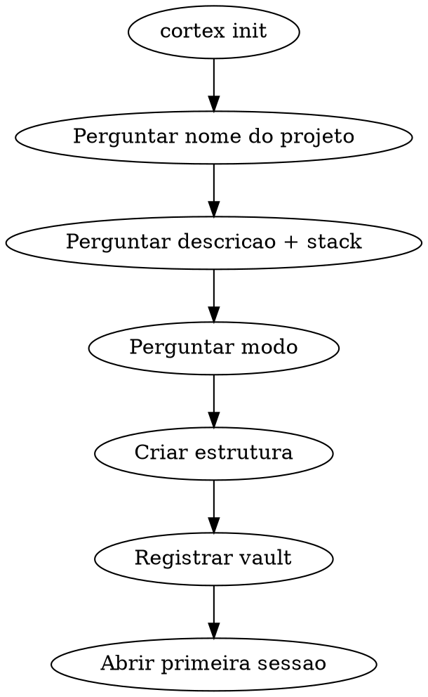
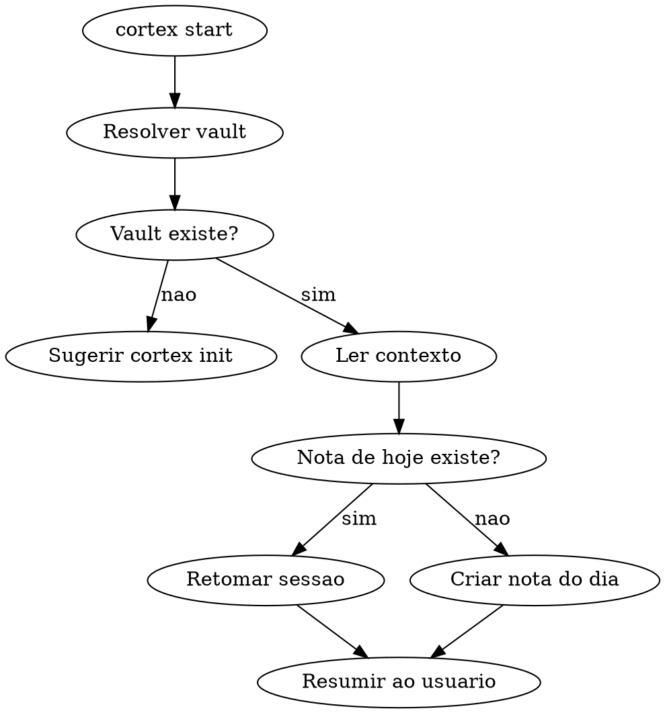
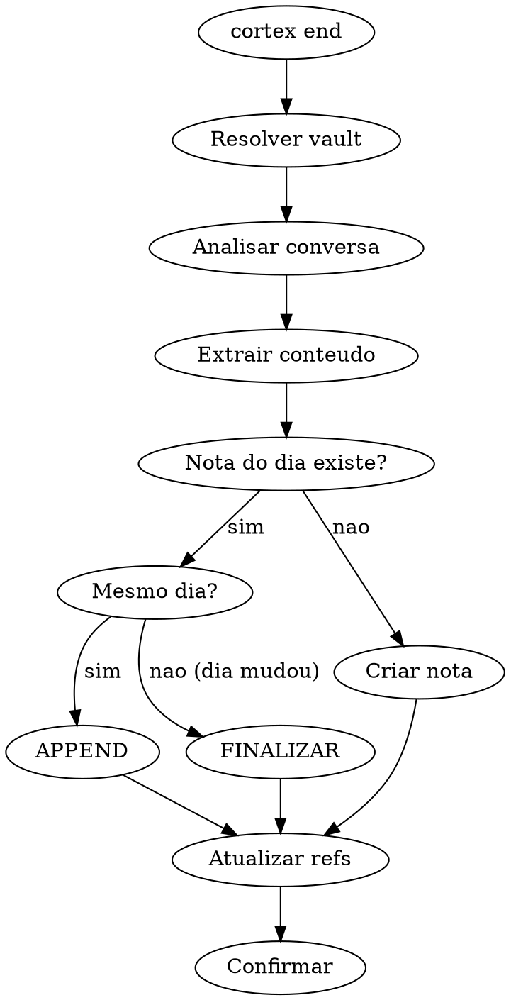

# Cortex

Skill unico para gerenciar o ciclo de vida de vaults Obsidian em projetos de software.
Tres comandos: `init` (criar vault), `start` (abrir sessao), `end` (fechar sessao).

## Uso

```
/cortex init          → cria vault novo (pergunta nome, modo)
/cortex start         → abre sessao do dia
/cortex end           → fecha sessao (salva no vault)
/cortex start VAULT   → abre sessao em vault especifico
/cortex end VAULT     → fecha sessao em vault especifico
```

Sem argumento de vault → pergunta qual usar.
Sem subcomando → pergunta o que quer fazer.

---

## INIT — Criar vault novo

### Fluxo



### Passo 1 — Coletar info

Perguntar ao usuario:

1. **Nome do projeto** (vira nome do vault)
2. **Descricao** (1 frase)
3. **Stack** (ou "ainda nao sei")
4. **Modo de trabalho:**

```
Como quer trabalhar?

1. Construir — tenho uma ideia, quero pensar e codar junto
2. Decidir — ja tenho spec/docs, quero organizar e tomar decisoes
3. Explorar — projeto existe sem docs, quero documentar conforme aprendo
```

### Passo 2 — Criar estrutura

Criar vault em `~/.cortex/vaults/<nome-projeto>/`.
Se `~/.cortex/vaults/` nao existir, criar.
Se `~/.cortex/vault-template/` existir, copiar como base.
Senao, criar arquivos seguindo a estrutura do framework.

Vault minimo viavel (3 arquivos preenchidos):
- `Memoria Projeto.md` — com nome, descricao, stack
- `Dominio/Glossario de Dominio.md` — vazio, pronto para preencher
- `Decisoes/Definicoes Travadas.md` — vazio, cresce a cada decisao

Demais notas: criar vazias seguindo o template.

Informar: "Vault criado em ~/.cortex/vaults/<nome>/. Abra no Obsidian como vault."

### Passo 3 — Comportamento por modo

**Construir:**
```
AI: "Me conta a ideia. Vou questionar pra gente modelar juntos."
→ Debate, questiona, sugere
→ Cada decisao vai para o vault
→ Quando quiser codar, AI usa o vault como contexto
```

**Decidir:**
```
AI: "Me passa o doc/spec/PRD. Vou extrair pro vault."
→ Le documento, distribui por nota (glossario, entidades, regras, duvidas)
→ Lista o que falta decidir
→ Cada decisao fica travada
```

**Explorar:**
```
AI: "Me passa o path do repo. Vou varrer e montar a base."
→ Le codigo, schema, README
→ Preenche Memoria Projeto, Entidades, Glossario, Padroes
→ Vault cresce task a task
```

### Passo 4 — Registrar vault

Adicionar na tabela de vaults conhecidos (ver secao abaixo).

---

## START — Abrir sessao

### Fluxo



### Ler contexto do vault

Usar ferramentas de filesystem diretamente:

```
# Leitura obrigatoria
Read ~/.cortex/vaults/<VAULT>/Memoria Projeto.md
Read ~/.cortex/vaults/<VAULT>/Sessoes/Sessoes - Memoria Temporal.md

# Identificar ultima sessao
Bash: ls ~/.cortex/vaults/<VAULT>/Sessoes/ | sort | tail -5
Read ~/.cortex/vaults/<VAULT>/Sessoes/<ultima-sessao>.md

# Decisoes travadas
Read ~/.cortex/vaults/<VAULT>/Decisoes/Definicoes Travadas.md
```

### Nota de hoje

- Se existe: **retomar** (nao criar nova — 1 nota por dia)
- Se nao existe: **criar** com pendencias herdadas da ultima sessao

### Resumir ao usuario

```
Sessao aberta — <VAULT> (YYYY-MM-DD):

Estado: [resumo do MOC]

Pendencias:
- [ ] ...

Definicoes travadas recentes:
- ...

O que vamos fazer?
```

---

## END — Fechar sessao

### Fluxo



### Analisar conversa

Revisar TODA a conversa e extrair:

| Campo | O que capturar |
|-------|---------------|
| **Decisoes** | Regras novas, escolhas, definicoes validadas |
| **Artefatos** | Commits, arquivos, migrations |
| **Descobertas** | Bugs, insights, comportamentos inesperados |
| **Proximos passos** | Pendencias para proxima sessao |

Conversa curta = nota curta. Nao forcar conteudo.

### Logica de dia

Verificar se nota existe:
```
Bash: ls ~/.cortex/vaults/<VAULT>/Sessoes/ | grep <DATA_HOJE>
```

| Situacao | Acao via filesystem |
|----------|------|
| **Mesmo dia** | `Edit` nota existente — APPEND `## Continuacao — [Tema]`. NAO finalizar. |
| **Dia diferente** | `Edit` nota existente — APPEND `## Encerramento` + resumo. |
| **Nota nao existe** | `Write` nota nova em `~/.cortex/vaults/<VAULT>/Sessoes/Sessao YYYY-MM-DD - Titulo.md` |

### Atualizar notas de referencia

Se houve na conversa, usar Read antes de Edit (nao duplicar):

| Aconteceu... | Arquivo a atualizar |
|---|---|
| Decisao confirmada | `~/.cortex/vaults/<VAULT>/Decisoes/Definicoes Travadas.md` |
| Questao resolvida | `~/.cortex/vaults/<VAULT>/Decisoes/Questoes em Aberto.md` (marcar [x]) |
| Questao nova | `~/.cortex/vaults/<VAULT>/Decisoes/Questoes em Aberto.md` (adicionar) |
| Anti-pattern | `~/.cortex/vaults/<VAULT>/Decisoes/Anti-patterns.md` |
| Entidade criada/alterada | `~/.cortex/vaults/<VAULT>/Dominio/Entidades.md` |
| Termo novo | `~/.cortex/vaults/<VAULT>/Dominio/Glossario de Dominio.md` |
| Modulo criado | `~/.cortex/vaults/<VAULT>/Arquitetura/Mapa de Modulos.md` |
| Endpoint criado | `~/.cortex/vaults/<VAULT>/Arquitetura/Contratos API.md` |

Regra: Read antes de Edit — nao duplicar.

### Confirmar

**Append:**
```
Sessao atualizada (dia vigente):
- Nota: Sessao YYYY-MM-DD - Titulo
- Adicionado: [resumo]
```

**Finalizada:**
```
Sessao finalizada — <VAULT>:
- Nota: Sessao YYYY-MM-DD - Titulo (ENCERRADA)
- Refs atualizadas: [lista]
```

---

## Vaults conhecidos

| Vault | Path base | Projeto |
|-------|-----------|---------|
| _(preencher ao criar vaults)_ | | |

---

## Regras gerais

1. **Uma nota por dia** — nunca criar segunda
2. **Vault = fonte da verdade** — consultar antes de implementar
3. **Wikilinks** — usar `[[nota]]` para conectar
4. **Nao forcar** — sessao curta = nota curta
5. **Herdar pendencias** — sempre trazer da sessao anterior
6. **Registrar vault novo** — adicionar na tabela acima
